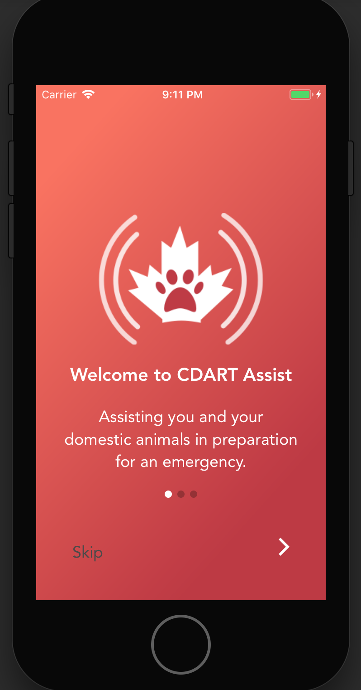

# cdart-spring-2017
React Native App for CDART



## Team Members:
- Montana Sawyer
- Warren Chan
- Evan Gray
- Andrew Nelson
- Iris Mendoza
- John Wat

## Project Technology
- React-Native
- React-Redux
- Javascript

## Project Description
A mobile application developed for the Canadian Disaster Animal Response Team (CDART) as part of the RED Academy Community Partnership program.
This app is intended to be used as a central hub for CDART volunteers to access learning resources, key forms and procedures, and training materials,
as well as for pet owners to share information about their pets that can be used by CDART volunteers to facilitate animal rescue in disaster scenarios.

## Installation and Setup
To get started:

1. Download or clone the repo.
2. Navigate to the root directory and run ```npm i``` from the command line to install depencencies.
3. Run ```react-native link``` to link libraries (necessary for libraries that contain native code).
4. Run the webpack packager to create the app bundle. In VSCode, use ctr+p > 'React Native: Start Packager' to run from the command pallete.
5. Install Xcode on your machine and setup a simulator.
6. From the project root directory, run the command: ```react-native run-ios``` to start the app in your iOS simulator.
